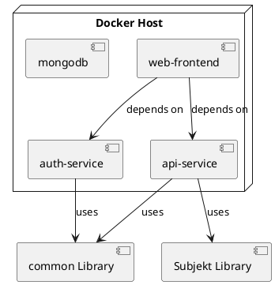

# Deployment and Publishing

All the Subjekts services can be deployed using `docker-compose` inside
the [Bootstrap](https://github.com/mini-roostico/bootstrap) repository. Follow the instructions in the README file to
deploy the services.

`auth`, `api` and `frontend` services are docker images automatically published on GitHub Container Registry through
GitHub Actions every release. 

`auth` and `api` share the same `common` library, which contains the domain models and utility code for both services.
This library is available on `npm` and can be installed using:
```bash
npm install @mini-roostico/api-common
```
The publishing takes place on every release through GitHub Actions.

The `subjekt` library is used by the `api` service and contains the actual business logic of the application.
This library is available on `npm`, Maven and GitHub Packages. The publishing takes place on every release through 
GitHub Actions on all three platforms.

The deployment of the whole project is summarized in the following diagram:

