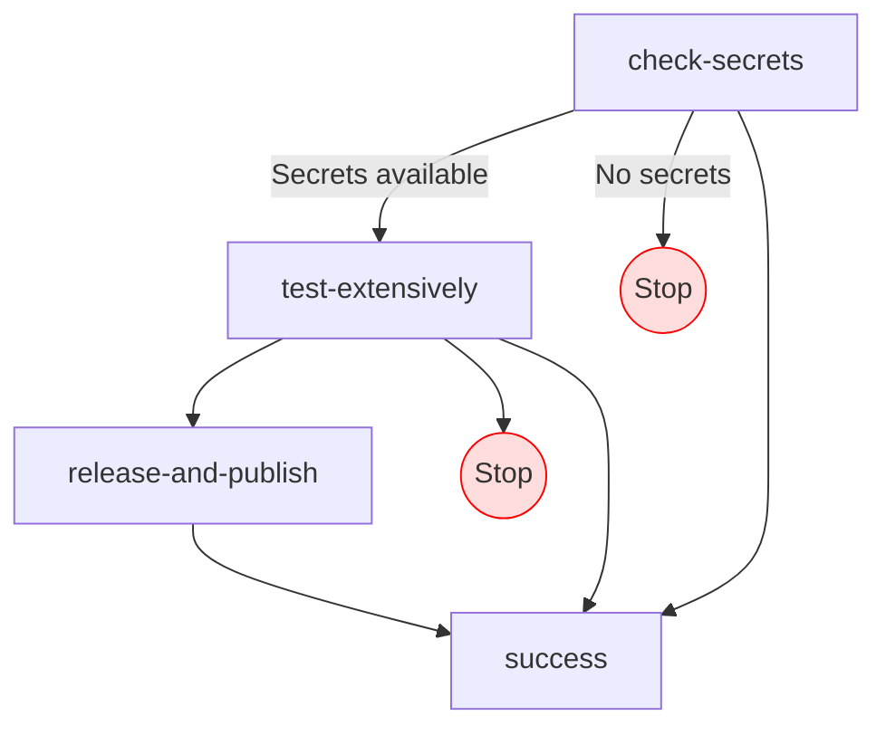
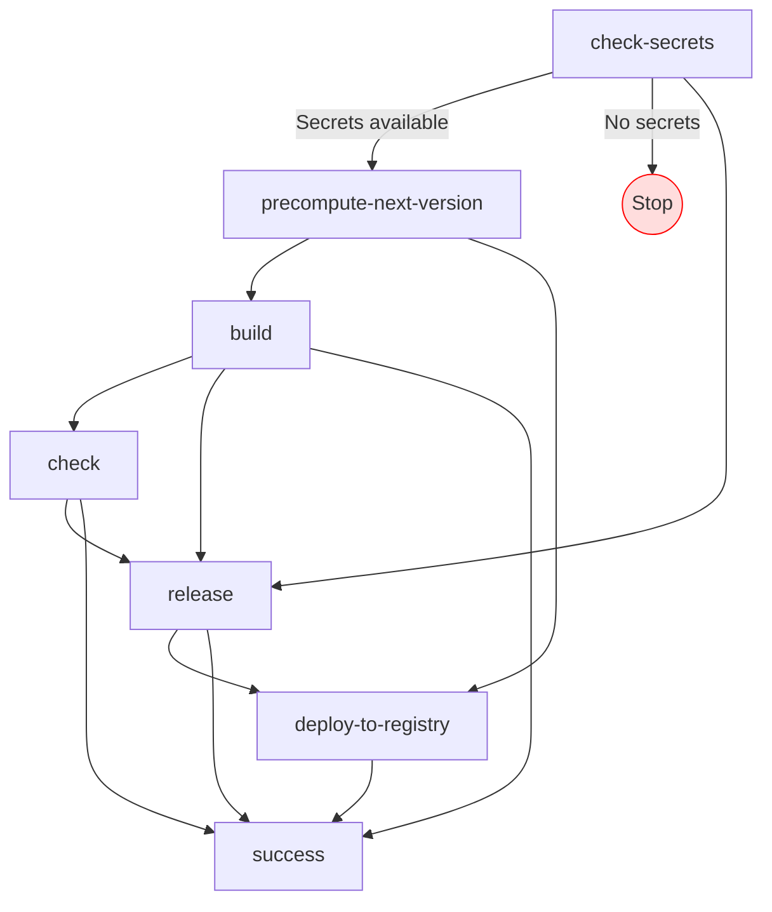

# DevOps

The project followed a mix of the *Trunk-based Development* and *Git flow* principles. Pull requests requirements for
merging were only related to CI/CD pipeline success, not involving PR reviews.

For the `web-api`, the major part of the development used several, separated long-lived feature branches, merging
through **Pull Requests** into the *develop* branch subsequently merged into the *main* every release.

For the `subjekt` library project, the project initially migrated from a JVM only project to a Kotlin Multiplatform
one using Git flow, organizing the migration into separated, big branches that were merged into a long-lived branch
called `feat/multiplatform` that was ultimately merged into the `main` branch introducing a breaking change and
therefore a `MAJOR` release. Following up to that, the approach adopted was the Trunk-based one, introducing smaller,
incremental changes with frequent releases, all backed by a relevant CI/CD pipeline.

Finally, for `web-frontend` and `bootstrap`, the projects started with Trunk-based approach since the beginning, with a
simple CI/CD pipeline to automatize publication and check the building outcome of the project. 

The whole project used **Conventional commits** when committing code as well as **Semantic Release and Versioning** for
automatic release and versioning through a solid CI/CD pipeline triggered on default branches. **Git Hooks** were used
in order to perform `pre-commit` checks on tests passing, code linting etc.

## CI/CD

In all the repositories a CI/CD pipeline was set up in order to guarantee code consistency and stability. 

### Subjekt - library

Where: 
- `check-secrets` checks if the necessary secrets are available for the CI/CD pipeline to run.
- `test-extensively` runs the tests for the library on a matrix of different platforms.
- `release-and-publish` releases the library to the public repository and publishes it on the target registries (Maven 
Central, NPM, GitHub Packages).
- `success` is the final step of the pipeline, where the pipeline is considered successful.

### Subjekt - web-api

TODO

### Subjekt - web-frontend

Where:
- `check-secrets` checks if the necessary secrets are available for the CI/CD pipeline to run.
- `precompute-next-version` computes the next version of the project based on the previous one and the commits since the
last release.
- `build` builds the project.
- `check` runs format and lint checks on the project.
- `release` releases the project to the public repository.
- `deploy-to-registry` deploys the project to the GitHub Packages Docker registry, ONLY if the `precompute-next-version`
step triggered a release.
- `success` is the final step of the pipeline, where the pipeline is considered successful.

