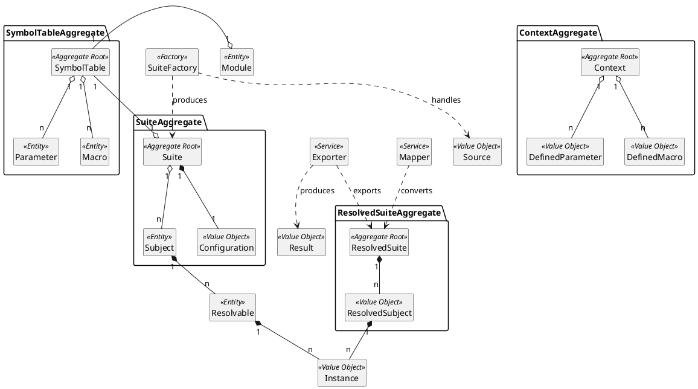
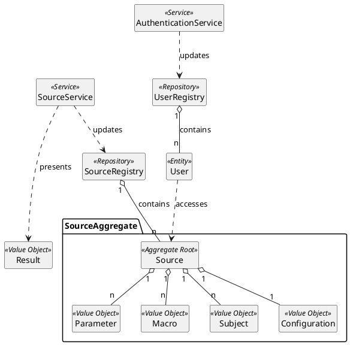
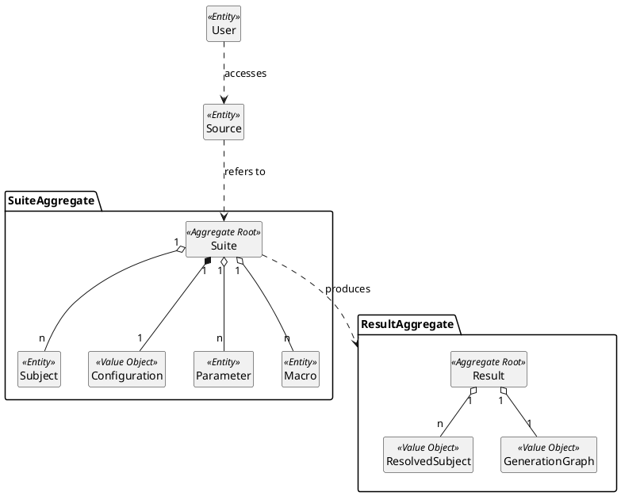
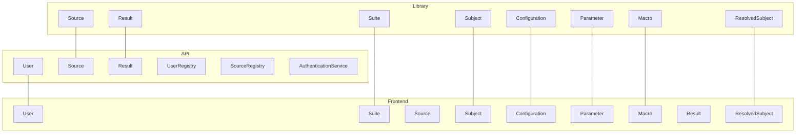
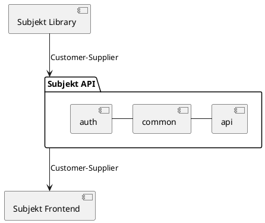
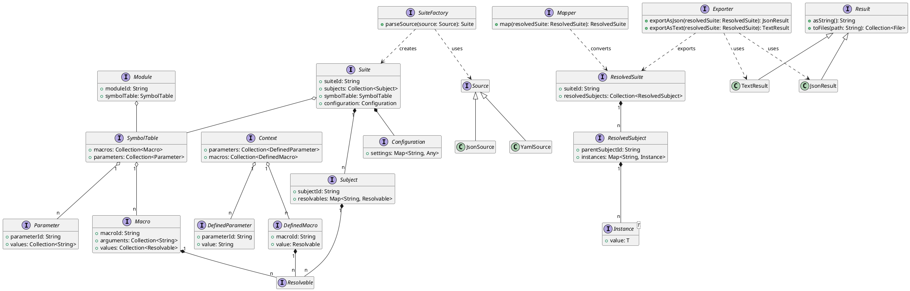
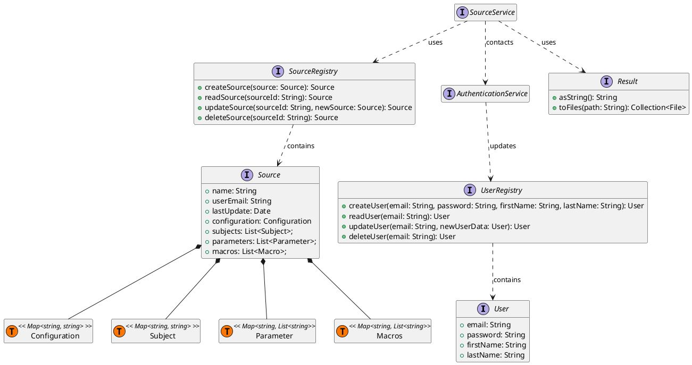
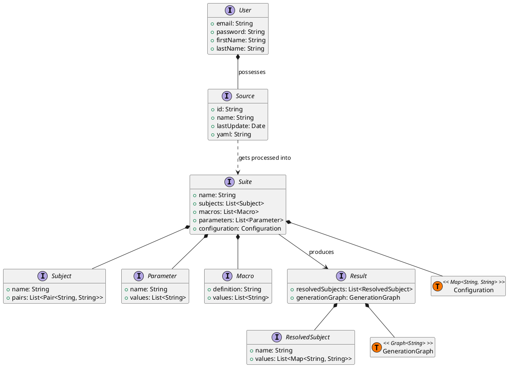

# Domain Driven Design

Starting from the glossary, the Domain Driven Design phase started identifying the various roles to assign to the
different concepts involved in the project. Mapping each element to the glossary, we identified three main contexts:

- Subjekt Library
- Subjekt API
- Subjekt Frontend

## Subjekt Library

In the context of the Subjekt library, we identified the following terms, expresses in ubiquitous language
(note: same as the glossary):

| Glossary term        | Definition                                                                                                                                                |
|----------------------|-----------------------------------------------------------------------------------------------------------------------------------------------------------|
| **Suite**            | A global object containing Parameters, Macros, Subjects, and a Configuration.                                                                             |
| **Parameter**        | A set of values identified by a unique name.                                                                                                              |
| **Macro**            | A function that takes a set of arguments and returns a set of possible values.                                                                            |
| **DefinedParameter** | A Parameter fixed to one of its possible values.                                                                                                          |
| **DefinedMacro**     | A Macro fixed to one of its possible values.                                                                                                              |
| **Resolvable**       | An object that, fixed to a Context, can be resolved to a single value.                                                                                    |
| **Context**          | One of the fixed sets of DefinedParameters and DefinedMacros from the possible permutations of Parameters and Macros values.                              |
| **Instance**         | A Resolvable that has been resolved to a single value by fixing the Context.                                                                              |
| **Subject**          | A conceptual unit that contains Resolvables. It encapsulates the configuration and behavior required to generate results in the form of ResolvedSubjects. |
| **ResolvedSubject**  | A result obtained from a Subject by transforming its Resolvables into Instances (i.e., by fixing a Context).                                              |
| **ResolvedSuite**    | A collection of ResolvedSubjects obtained by resolving all Subjects in a Suite.                                                                           |
| **Configuration**    | A set of values that can be used to configure the generation.                                                                                             |
| **Exporter**         | An entity that converts a ResolvedSuite into a given format.                                                                                              |
| **Result**           | An object that represents the result produced by an Exporter.                                                                                             |
| **Source**           | An object that provides all the Suite's data.                                                                                                             |
| **SuiteFactory**     | An entity that creates a Suite from a Source.                                                                                                             |
| **Module**           | A library providing a set of Parameters and DefinedMacros.                                                                                                |
| **Mapper**           | An entity that applies a conversion to a ResolvedSuite (e.g., code linter).                                                                               |

And subsequently, we drew their context map:

## Subjekt API

In the context of the Subjekt API, we identified the following terms, expresses in ubiquitous language
(note: same as the glossary):

| Glossary term             | Definition                                                         |
|---------------------------|--------------------------------------------------------------------|
| **User**                  | A person who interacts with the API.                               |
| **Source**                | A configuration object that can be saved and edited.               |
| **Parameter**             | A set of values identified by a unique name.                       |
| **Macro**                 | A map from a name definition to a set of values                    |
| **Subject**               | A map of keys and values that defines the output of the generation |
| **Configuration**         | A set of values that can be used to configure the generation.      |
| **Result**                | An entity that represents the result of the Source elaboration.    |
| **UserRegistry**          | An entity that manages the users' repository.                      |
| **SourceRegistry**        | An entity that manages the sources' repository.                    |
| **AuthenticationService** | An entity that manages users' authentication.                      |                                                       |

There are some homonym terms with the Subjekt Library context, but their definition is slightly different. For example:
- `Source`: its definition refers to the fact of being *editable* and *"saveable"*.
- `Result`: its definition refers more to the fact of being the *final product* of the elaboration, rather than an 
object produced by an `Exporter` (which is not present in this context).
- `Parameter`, `Macro`, `Subject`, `Configuration`: here they represent simple data structures that are used to 
generate the final result. The `Suite` is not present, in fact these objects represent only the data that will be
saved and edited as `Source`, the one fed to the Subjekt Library.

The following is the context map for the Subjekt API:

## Subjekt Frontend

The Subjekt Frontend is the context which has more in common with the previous ones, in fact is not presented in the 
glossary section. All the terms are expressed, contrary to previous contexts, in the scope of "customization" and 
"presentation". 

| Glossary term       | Definition                                                                                                                 |
|---------------------|----------------------------------------------------------------------------------------------------------------------------|
| **User**            | A person who can create/edit/open Sources.                                                                                 |
| **Suite**           | A container of values that can used to generate results.                                                                   |
| **Source**          | A configuration object that can be saved and edited.                                                                       |
| **Subject**         | An entity that contains key-value pairs that define the generation results.                                                |
| **Configuration**   | An object that contains key-value pairs that customize some global generation preferences.                                 |
| **Parameter**       | An entity that can have multiple values and that can be used inside Subjects                                               |
| **Macro**           | An entity that can accept multiple arguments and values that depends on the arguments and that can be used inside Subjects |
| **Result**          | The result produced after running a generation.                                                                            |
| **ResolvedSubject** | An object that contains key-value pairs that represent results of the generation.                                          |
| **GenerationTree**  | An object that contains the tree of the generation process.                                                                |

The context map for the Subjekt Frontend is the following:

## Bounded Contexts

After analyzing the three contexts, we identified the following bounded contexts, focusing on the common terms and 
identifying the related differences:

The common terms between contexts have been highlighted. 

## Architecture

The global architecture adopted **customer-supplier** as model integrity pattern, with the Subjekt Library as the 
supplier and the Subjekt API as customer. The Subjekt Frontend is a customer of both the Subjekt Library and the Subjekt
API. 

Inside the Subjekt API context, the **shared kernel** pattern has been adopted to share the model for two different
sub-contexts, `auth` and `api`, sharing a `common` model.

The following is the architecture diagram:

## Design in detail

After the initial analysis of the contexts and the architecture, we started designing a more detailed version of the 
model. Following DDD principles, we translated the main entities and value objects into a class diagram.

### Subjekt Library class diagram

As we can see, additional relationships have been added to the diagram, such as the one between `Resolvable` and 
`DefinedMacro`. This relationship arose when we realized that a `DefinedMacro` can be seen as a `Resolvable` too, but 
only with a single value. This less abstract connection together with others helped us to better understand the model 
and to design a more cohesive and consistent system.

### Subjekt API class diagram

The `Source` class acts as a container for all the data that will be used by the Subjekt Library to generate the final
result. The `Result` class is used to represent the final product of the elaboration, and it is used by the 
`SourceService`. 

The entries of the `Source` class are all **type aliases**: this choice has been made since they don't need any extra 
logic, and they are just data containers (in fact they are all *Value Objects*).

### Subjekt Frontend class diagram

Main entities of the Subjekt Library are used also in the Subjekt Frontend. Here the `Suite` class is used to represent
the `Source` from the point of view of the *generation*, while the `Source` is used to represent the management of the
`User` saved data. The `Source` is saved containing a YAML, meaning that the `Suite` gets processed inside the 
application logic. The `Result` is the final product of the generation process, and it contains the 
`ResolvedSubject`s and the `GenerationGraph` summarizing the process.
