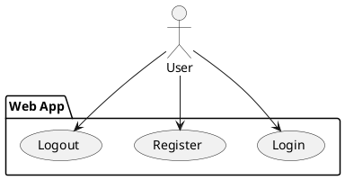
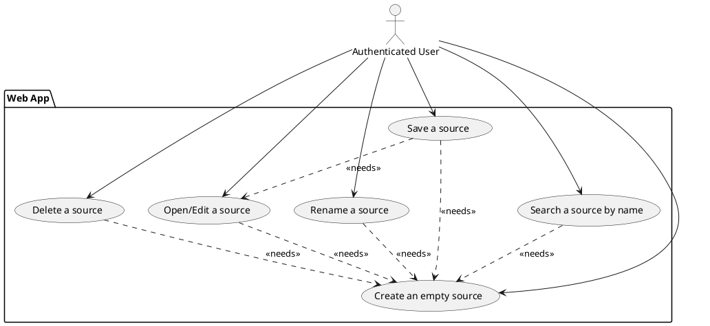
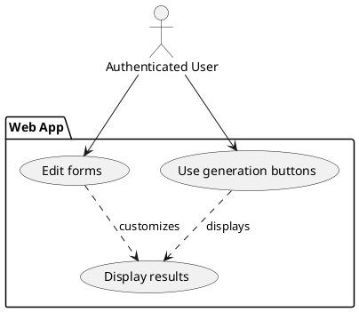
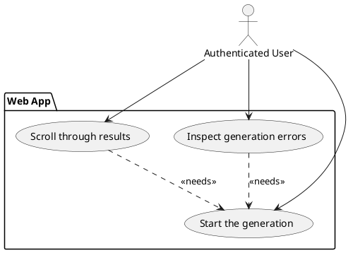

# Requirements

A *Requirement analysis* phase was performed in order to investigate the project's main features and stakeholders'
requirements that were expected but not already clearly defined.

## Business Requirements

### The user can log in/register using a web app

### The user can look through his/her saved works

The user is able to manage sources, creating/renaming/deleting them as well as opening one in order to edit it. The user
can then save its modifications.

### The user can customize the generation through simple forms

After a successful authentication, the user can open one of his/her available works and start generating results.
Using simple forms in the application, he/she can customize the generation parameters in order to define the final 
results.

### The user can inspect the results of the generation easily

After running a generation, the user can scroll through the obtained results, showing them in various forms depending
on the starting configuration. If an error occurred during the generation, the user can inspect the type of error and 
correct eventual mistakes in the configuration.

## Functional Requirements

### The user can authenticate to the system

- The user can provide a configuration through simple web forms;
- The user can save his/her work and continue it later on;
- The user can reuse parts of previously used configurations;
- The user can display the results of the generation in various forms, for example: simple text, graphs of the results
  displaying the permutation tree, code snippets;

## Non-Functional Requirements

## Implementation Requirements

User Requirements:
The user can authenticate to the system;
The user can provide a configuration through simple forms;
The user can save its work;
The user can reuse parts of previously used configuration;
The user can display the results of the generation in various forms, for example: simple text, graphs of the results
displaying the permutation tree, code snippets;
The user can download the results as compressed archives.
System Requirements:
The system library is available for multiple platforms (JVM, Javascript)
The web application will be available by means of a REST API and a simple frontend interface