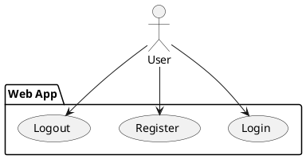
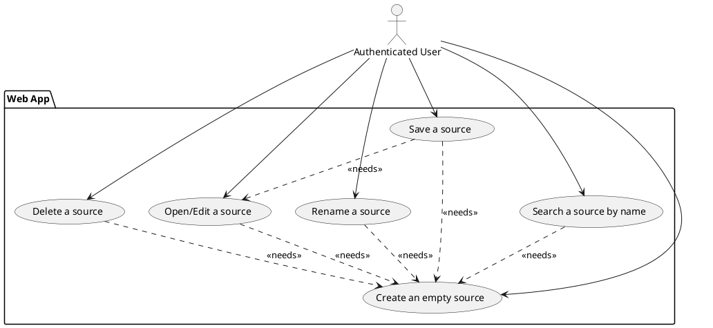
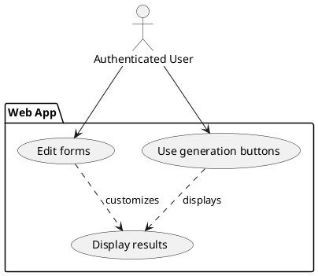
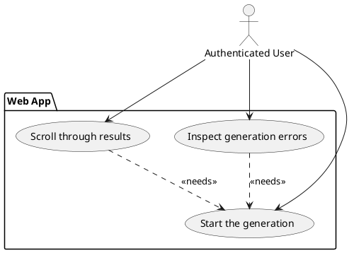

# Requirements

A *Requirement analysis* phase was performed in order to investigate the project's main features and stakeholders'
requirements that were expected but not already clearly defined.

## Business Requirements

### The user can log in/register using a web app

### The user can look through his/her saved works

The user is able to manage sources, creating/renaming/deleting them as well as opening one to edit it. The user
can then save its modifications.

### The user can customize the generation through simple forms

After a successful authentication, the user can open one of his/her available works and start generating results.
Using simple forms in the application, the generation parameters can be customized to define the final results.

### The user can inspect the results of the generation easily

After running a generation, the user can scroll through the obtained results, showing them in various forms depending
on the starting configuration. If an error occurred during the generation, the user can inspect the type of error and 
correct eventual mistakes in the configuration.

## Functional Requirements

### The user can authenticate to the system

The user must be able to register as a new user or log in to get authenticated. Some features of the system 
may not be available unless authenticated. 

### The user can generate results through a configuration

The user can provide a configuration in various forms, for example a YAML document or simple customizable HTML forms.
Depending on the values set in this configuration, the system must generate results that can be made available as 
simple text, a JSON document or as files of various formats. 

### The user can reuse part of the configuration various times 

The user can use **parameters** and **macros** as a mean to avoid repeating the same values in the configuration 
multiple times. Parameters are identified by a name and are constituted of multiple values that are plain strings. 
Macros are like parameters, but can accept arguments and return different values depending on the arguments that are 
passed. 

It is possible to reuse the same parameters and macros multiple times to generate multiple results.

### The generation uses expressions that permute parameters and macros values

Inside the configuration provided, the user can specify parts of text, called **Subjects** defined by **expressions**
that can use parameters and macros values inside them. The output of these parts are all the possible permutations 
obtained substituting all the possible parameters and macros values. 

### The user can customize the expressions delimiters and other generation parameters

Using specific configuration values, the user can customize how to identify the expression inside the text of the 
subjects, using custom delimiters. Other parameters can be set in order to guide the generation, for example 
deciding adding a *preamble* to each generated result. 

### The user can display a tree showing the origin of the results

Since each *subject* can contain permutations of expressions, group of results referring to the same parent subject 
must be grouped and displayed in tree-like structure, making the generation outcome clear.

## Non-Functional Requirements

### The generation must be sufficiently fast

Between the start of the generation and the outputs getting displayed the user doesn't have to wait more than a few 
seconds.

### The user interface must be clear and easy to use

The way the results are displayed must be clear and not confusing. The user must be able to navigate the interface 
and understand how to customize a generation without too much effort.

## Implementation Requirements

### The system library is available for multiple platforms (JVM, Javascript)

When using the system as a software library, JVM-based languages and Javascript projects must be possible hosts.

### The system is available by means of a REST API and a simple frontend interface

When using the system as a standalone project, all of its features must be available through a REST API service and 
a frontend user interface. 